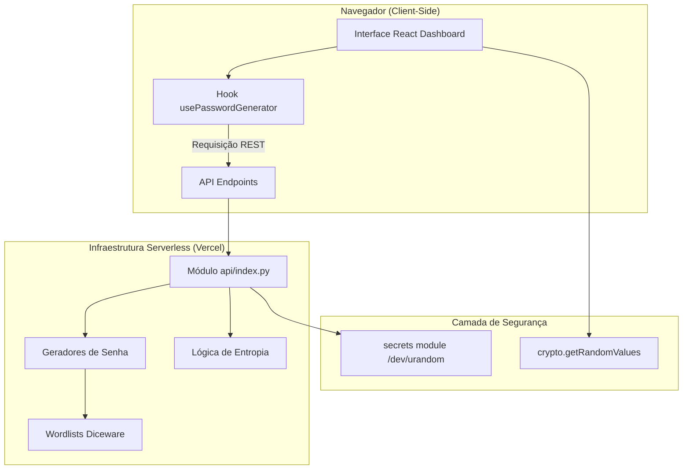

# 🏗️ Documentação de Arquitetura — SecureGen

Esta documentação detalha a arquitetura do projeto **SecureGen**, um gerador de senhas focado em privacidade, segurança e versatilidade. O sistema foi projetado para operar como uma aplicação **Full-stack Moderna**, otimizada para infraestruturas **Serverless** (como Vercel).

---

## 1. Visão Geral do Sistema

O SecureGen utiliza uma arquitetura modular unificada:

1.  **Backend (API Serverless):** Implementado em **FastAPI (Python)**, reside na pasta `/api`. Funciona de forma *stateless* (sem estado), processando requisições de geração e retornando resultados instantaneamente sem persistência em disco.
2.  **Frontend (Dashboard):** Aplicação **React (Vite)** que consome a API. Gerencia toda a interface, estados de configuração e exibição segura no navegador.

### Diagrama de Arquitetura



---

## 2. Tecnologias Utilizadas

### Frontend
-   **React 19 + Vite 7:** Framework para a interface de alta performance.
-   **Vanilla CSS:** Design System próprio baseado em Glassmorphism e HSL adaptativo.

### Backend (Python 3.10+)
-   **FastAPI:** Framework ASGI para endpoints redundantes e velozes.
-   **Vercel Python Runtime:** Gerenciamento de funções serverless.

### Segurança
-   **Server-side:** Módulo `secrets` do Python — interface segura do SO.
-   **Privacidade:** Arquitetura **Zero Knowledge** (nenhum dado é salvo no servidor).

---

## 3. Modelo de Segurança: Zero Knowledge

O SecureGen segue o princípio de **Confiança Zero (Zero Trust)**:
-   **Sem Bancos de Dados:** Não existem tabelas de usuários, históricos ou logs de senhas.
-   **Memória Volátil:** A senha gerada permanece na memória RAM do servidor apenas durante a fração de segundo necessária para retornar a resposta JSON. 
-   **Zero Logs:** O backend é configurado para não registrar no log os parâmetros sensíveis das requisições.

---

## 4. Estrutura de Diretórios Detalhada

```bash
/
├── api/                # Backend FastAPI (Padrão Serverless Vercel)
│   ├── index.py        # Entrypoint da API
│   └── ...             # Utilitários de histórico (removidos/desativados)
├── banco_dados/        # Wordlists Diceware oficiais
├── core/               # Lógica matemática (entropia.py)
├── diceware/           # Processamento dinâmico de listas de palavras
├── frontend/           # Aplicação Dashboard em React
│   ├── src/
│   │   ├── components/ # Legenda de Entropia, Generator, Modals
│   │   └── hooks/      # Integração com a API local/remota
├── password_generators/# Algoritmos de geração (Classic, Hex, URL, UUID)
├── vercel.json         # Orquestração de deploy (Frontend + Backend)
├── requirements.txt    # Dependências de infraestrutura Python
└── run_app.sh          # Script de desenvolvimento local sincronizado
```

---

## 5. Legenda e Força de Senha

O sistema utiliza a biblioteca `math` para calcular a entropia real com base no pool de caracteres ativo:
$$E = L \cdot \log_2(R)$$
Onde $L$ é o comprimento e $R$ o tamanho do alfabeto de caracteres. 

A classificação visual é segmentada em 6 níveis cromáticos, permitindo que o usuário identifique o risco da senha antes de utilizá-la em serviços reais.

---
*Documento atualizado em 25/02/2026 para refletir a transição para arquitetura Serverless.*
